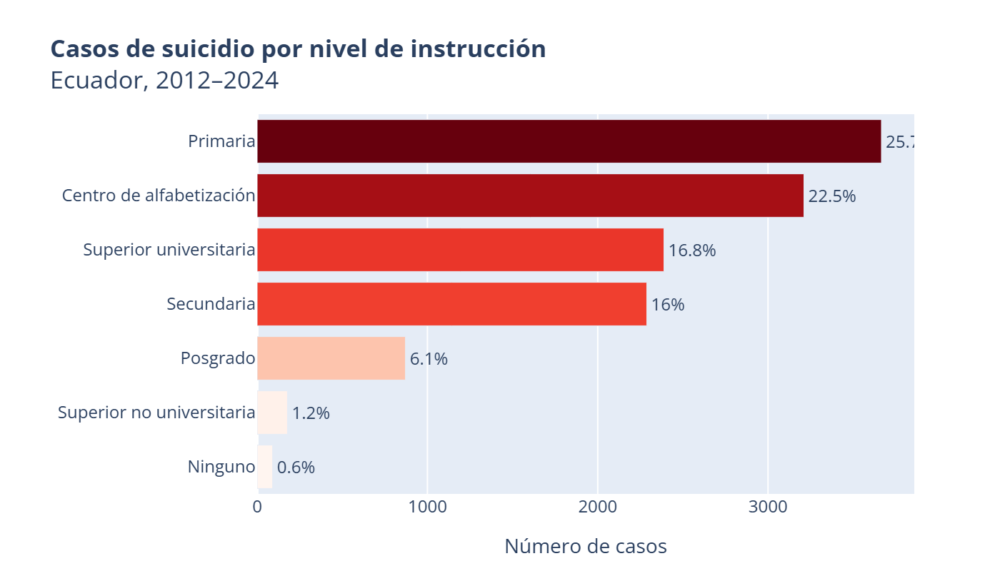
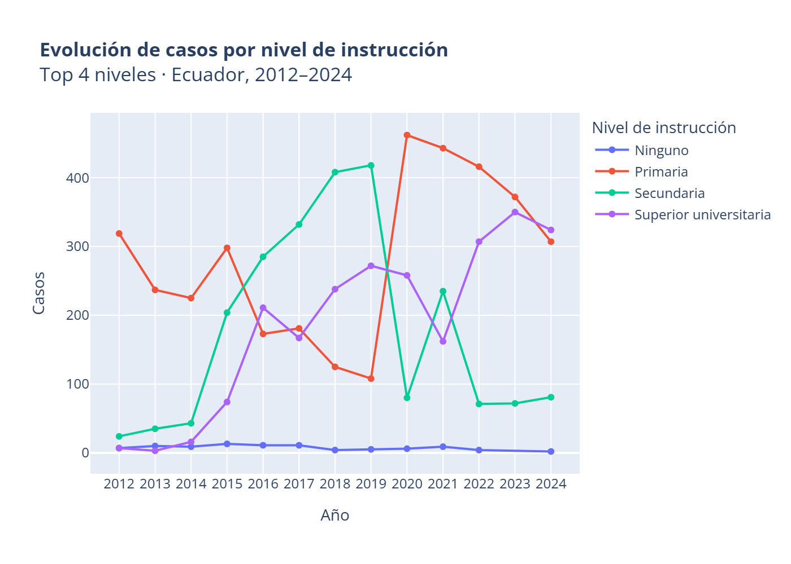
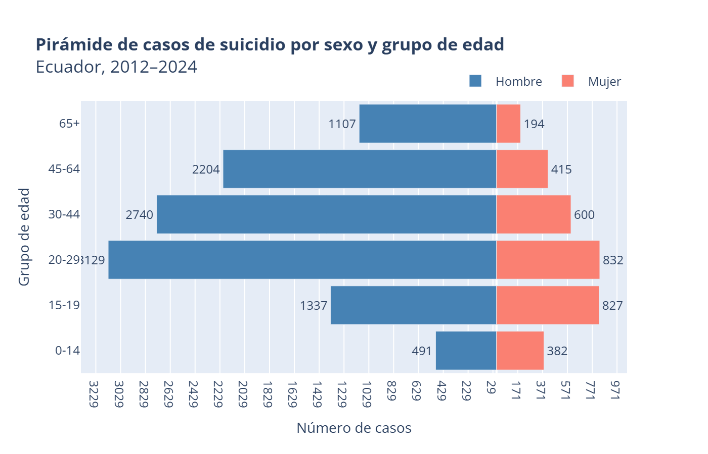
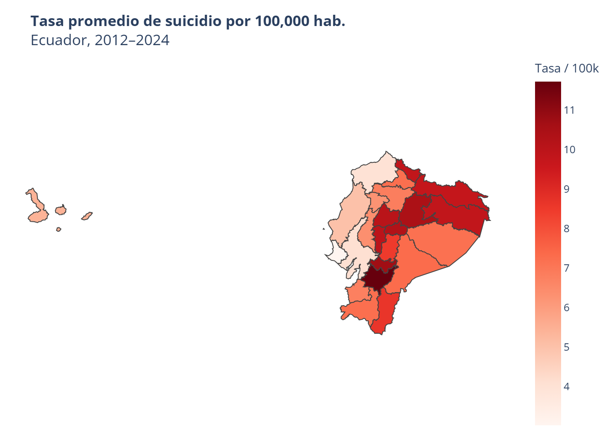
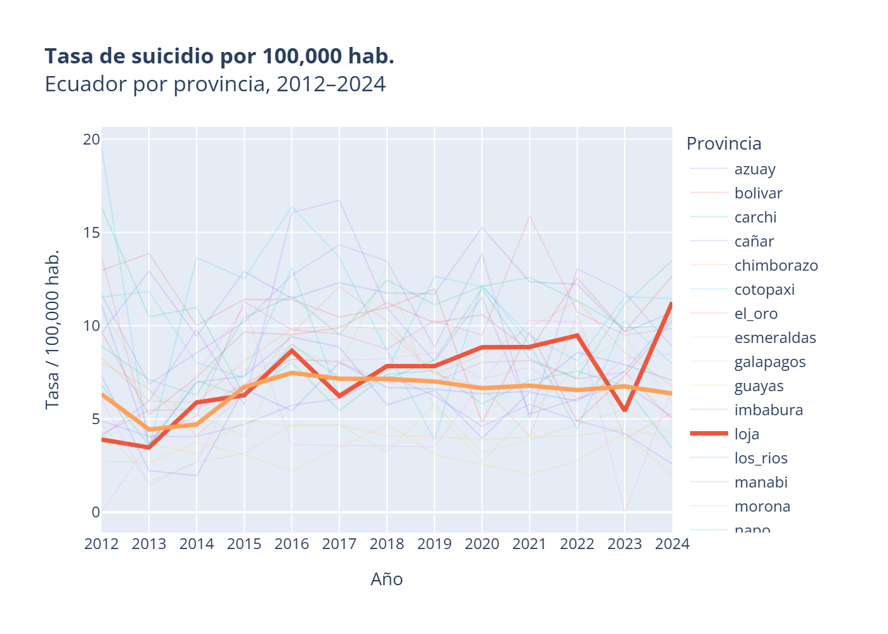

# 🇪🇨 Análisis de Suicidio en Ecuador (2012–2024)

Análisis exploratorio de las tasas de suicidio en Ecuador a nivel nacional y provincial, desagregadas por **sexo** y **grupo etario**, utilizando datos oficiales del INEC.

---

## 📌 Descripción

Este proyecto calcula y visualiza las **tasas de suicidio por 100,000 habitantes** en Ecuador entre 2012 y 2024, cruzando dos fuentes de datos oficiales:

1. **Registro de Defunciones Generales** (INEC) — casos de muerte por causas CIE-10 X60–X84.
2. **Proyecciones Poblacionales Provinciales** (INEC) — denominadores por provincia, sexo y grupo etario.

---

## 📁 Estructura del Repositorio

```
suicidio-ecuador/
├── data/
│   ├── EDG/            # Archivos .sav del Registro de Defunciones Generales (INEC)
│   ├── pobLacion/      # Excel de proyecciones poblacionales quinquenales (INEC)
│   └── mapa/           # Shapefile de provincias del Ecuador
├── notebook/
│   └── Suicidio.ipynb  # Notebook principal de análisis
├── outputs/            # Gráficos exportados
├── .gitignore
├── requirements.txt
└── README.md
```

> ⚠️ **Los archivos de datos no se incluyen en el repositorio** por su tamaño y porque son de acceso público en el sitio del INEC. Ver sección [Fuentes de Datos](#-fuentes-de-datos).

---

## 🔍 Metodología

| Paso | Descripción |
|------|-------------|
| **1. Carga** | Se cargan los archivos `.sav` de defunciones (2012–2024) y el Excel de proyecciones de población. |
| **2. Filtrado** | Se identifican los suicidios usando los códigos CIE-10 `X60–X84`. |
| **3. Codificación** | Se etiquetan provincia, sexo y grupo de edad. |
| **4. Tasa** | `tasa_100k = (casos / población) × 100,000` por año, provincia, sexo y grupo etario. |
| **5. Visualización** | Mapa coroplético y series temporales interactivas con Plotly. |

---

## 📊 Visualizaciones

### Casos de suicidio por nivel de intrucción


### Evolución temporal por nivel de instrucción


### Pirámide de Casos por Sexo y Grupo de Edad


### Mapa Coroplético — Tasa Promedio por Provincia

### Serie Temporal por Provincia

---

## 📊 Visualización Interactiva 
https://public.tableau.com/app/profile/edisson.i.iguez/viz/Analisis_Suicidio/Dashboard1


## 📋 Fuentes de Datos

| Dataset | URL | Notas |
|--------|-----|-------|
| Registro de Defunciones Generales | [INEC](https://www.ecuadorencifras.gob.ec/defunciones-generales/) | Archivos `.sav` por año |
| Proyecciones Poblacionales | [INEC](https://www.ecuadorencifras.gob.ec/proyecciones-poblacionales/) | Excel quinquenal 1990–2035 |
| Shapefile Provincias Ecuador | [IGM / INEC](https://www.ecuadorencifras.gob.ec/informacion-geografica/) | — |

---

## ⚙️ Instalación

```bash
# 1. Clonar el repositorio
git clone https://github.com/tu-usuario/suicidio-ecuador.git
cd suicidio-ecuador

# 2. Crear entorno virtual (opcional pero recomendado)
python -m venv venv
source venv/bin/activate        # Linux/Mac
venv\Scripts\activate           # Windows

# 3. Instalar dependencias
pip install -r requirements.txt

# 4. Agregar los datos en las carpetas correspondientes (ver estructura)

# 5. Abrir el notebook
jupyter notebook notebook/Suicidio.ipynb
```

---

## 📦 Dependencias

Ver `requirements.txt`. Principales:

- `pandas` — manipulación de datos
- `pyreadstat` — lectura de archivos SPSS (`.sav`)
- `openpyxl` — lectura de Excel
- `geopandas` — datos geoespaciales
- `plotly` — visualizaciones interactivas

---

## ⚠️ Limitaciones

- Los denominadores son **proyecciones**, no censos reales para cada año.
- Posible **subregistro** de suicidios clasificados como causas indeterminadas.
- El análisis es a **nivel provincial**; no hay desagregación cantonal con esta fuente.

---

## 📄 Licencia

MIT License — ver `LICENSE` para detalles.

---

*Elaborado con datos públicos del INEC | Ecuador*
